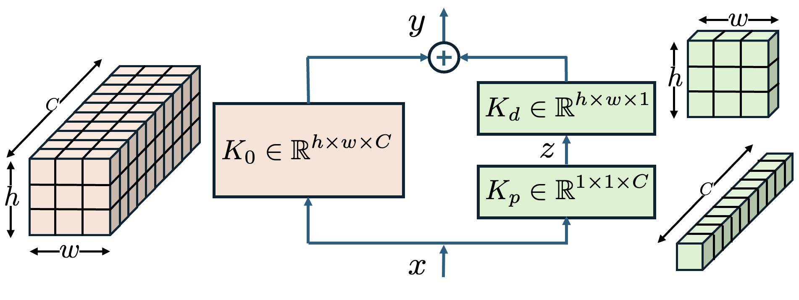
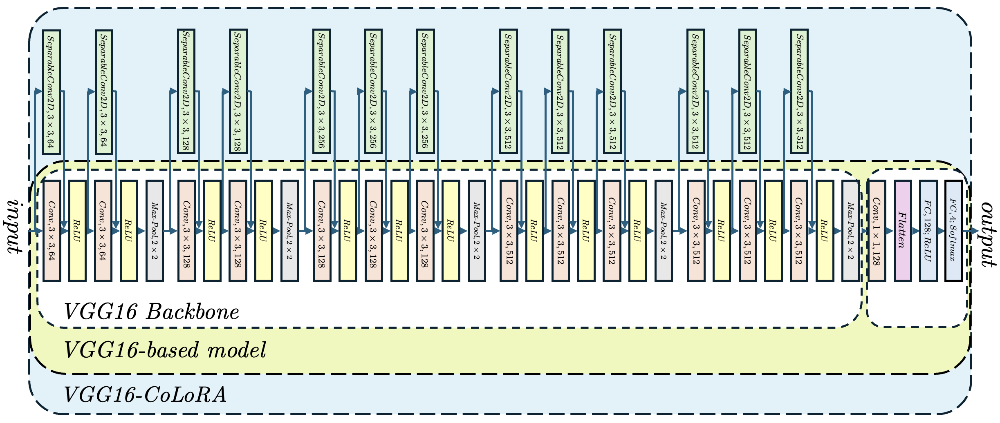
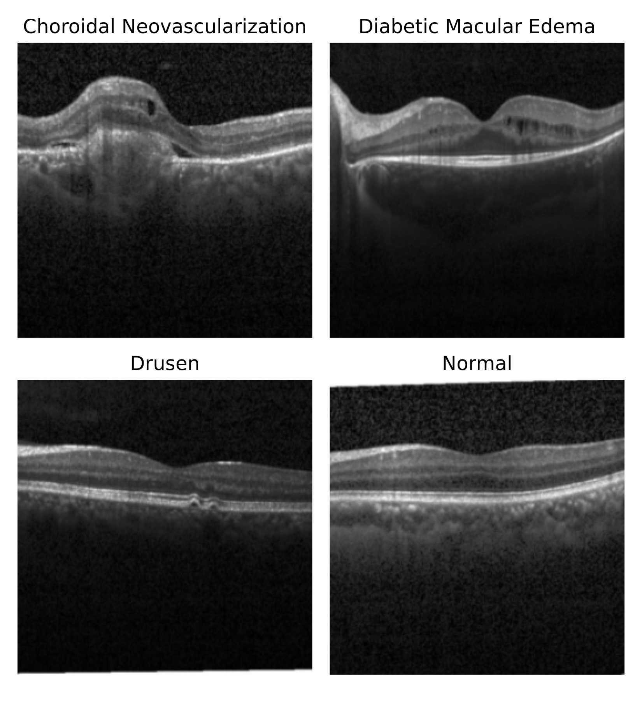
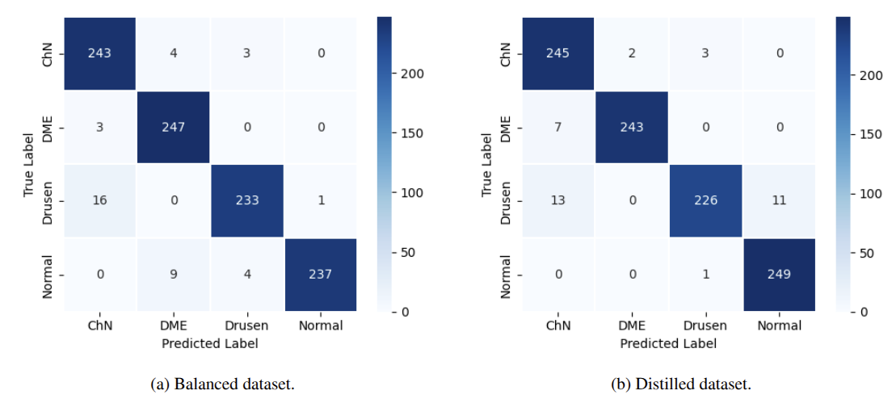

# COLORA: Efficient Fine‑Tuning for Convolutional Models (OCT Case Study)

[](https://www.python.org/downloads/)
[](https://www.tensorflow.org/)
[](https://keras.io/)
[](LICENSE)
[](https://arxiv.org/abs/2505.18315)

---

**CoLoRA (Convolutional Low-Rank Adaptation)** is a **parameter-efficient fine-tuning (PEFT)** method for convolutional neural networks.  
It extends *Low-Rank Adaptation (LoRA)* to CNNs by introducing a structured low-rank decomposition in convolutional kernels, drastically reducing the number of trainable parameters while maintaining — or even improving — model accuracy.

This repository provides the **official implementation** used in the paper:

> Rivera, M., & Hoyos, A. (2025).  
> *CoLoRA: Efficient Fine-Tuning for Convolutional Models with a Study Case on Optical Coherence Tomography Image Classification.*  
> Centro de Investigación en Matemáticas (CIMAT), México.  
> [arXiv:2505.18315](https://arxiv.org/abs/2505.18315)

---

## Highlights

- **>80% fewer trainable parameters** compared to full fine-tuning  
- **Plug-and-play CoLoRA layer** for any CNN backbone (e.g., VGG16, ResNet50v2)  
- **No inference overhead** – merged into the base weights after training  
- **Superior accuracy and stability** vs. standard fine-tuning  
- **Validated on OCTMNIST** (Optical Coherence Tomography images)

---

## Abstract

We introduce the Convolutional Low-Rank Adaptation (CoLoRA) method, designed to overcome inefficiencies in current CNN fine-tuning. CoLoRA is a natural extension of Low-Rank Adaptation (LoRA) to convolutional architectures. Using ImageNet-pretrained backbones (VGG16, ResNet50), CoLoRA enables stable, accurate, and efficient coarse-/fine-tuning while significantly reducing trainable parameters. On OCTMNIST, CoLoRA achieves nearly 5% accuracy improvement over classical fine-tuning and exceeds state-of-the-art models (Vision Transformer, State-space, KAN) by ~1–4%. CoLoRA maintains inference parameters unchanged and reduces trainable parameters. We validate with VGG16 and ResNet50.

Keywords: Convolutional Networks · Fine–tuning · Transfer Learning · LoRA · OCTMNIST

---

## Overview

### LoRA vs CNN kernel vs CoLoRA decomposition
- LoRA applies low-rank updates to dense layers.  
- CoLoRA applies low-rank updates to convolutional kernels via depthwise + pointwise separable convolutions.

### CoLoRA layer (trainable residual separable convolution)
- Residual separable conv is added to the frozen backbone conv.  
- After each epoch, residual weights are merged; trainable residuals are reset for the next epoch.



### Inception-style operation order and internal operations
- First reduce channel correlations (1×1 pointwise), then learn spatial correlations (depthwise).  
- Efficient, parameter-light, and generalizable to 1D/3D (given depthwise support).

---

## Architecture: VGG16‑CoLoRA

We split Conv2D and activation (ReLU) explicitly, initialize ImageNet weights, and add a residual SeparableConv2D bypass per conv layer (pointwise initialized with Glorot, depthwise initialized as zeros). The decision head uses 1×1 conv (512→128), Dense(128, ReLU), and Dense(4, logits) for the four OCT classes.

- Total params (VGG16‑CoLoRA): ~15.58M  
- Trainable by backprop per epoch: ~2.5M (merged into backbone after each epoch)  
- Per‑epoch time: ~142 s on NVIDIA RTX 3090



---

## Dataset (OCTMNIST v2)

Four classes:  
- Choroidal Neovascularization (ChN)  
- Diabetic Macular Edema (DME)  
- Drusen  
- Normal

Very unbalanced (e.g., Drusen: 7,754 vs Normal: 46,026). To avoid dependence on heavy class balancing or augmentation, we:
- Build a Balanced dataset using the first 7,754 samples per class (31,016 total)
- Build a Distilled dataset by sorting by prediction entropy from the best pretrained model, discarding top 10 high-entropy samples per class, and taking the next 7,040 per class



---

## Training Protocol

- Backbone: ImageNet‑pretrained VGG16 or ResNet50  
- CoLoRA per Conv2D: SeparableConv2D residual (pointwise Glorot init; depthwise zeros)  
- Optimizer: Adam (defaults)  
- Epoch schedule: 20 epochs; after each epoch merge residuals into base convs and reset residuals  
- Datasets: Balanced and Distilled variants  

---

## Results

### Confusion matrices (Balanced vs Distilled)



### Comparison to State‑of‑the‑Art (Table 5)

VGG16‑CoLoRA achieves Acc = 0.963, AUC = 0.995 using ~2.5M backpropagated parameters (15.6M total, merged), improving classical transfer learning by ~5% and outperforming ViT / State‑space / KAN baselines by ~1–4%.

| Method                                          | AUC     | Acc.   | Params.        |
|------------------------------------------------|---------|--------|----------------|
| ResNet-18 (28) [medmnistv1]                    | 0.951   | 0.758  |                |
| ResNet-50 (224) [medmnistv1]                   | 0.951   | 0.750  |                |
| Dedicated CNN (28) [wilhelmi2024simple]        |         | 0.760  |                |
| ResNet-50 (224) [wilhelmi2024simple]           |         | 0.776  |                |
| MedViTv1-T [manzari2023medvit]                 | 0.961   | 0.767  | 15.2M          |
| MedViTv1-S [manzari2023medvit]                 | 0.960   | 0.782  |                |
| MedViTv1-L [manzari2023medvit]                 | 0.945   | 0.761  |                |
| MedKAN-S [yang2025medkan]                      | 0.993   | 0.921  | 11.5M          |
| MedKAN-B [yang2025medkan]                      | **0.996** | 0.927  | 24.6M          |
| MedKAN-L [yang2025medkan]                      | 0.994   | 0.925  | 48.0M          |
| MedMamba-T [yue2024medmamba]                   | 0.992   | 0.918  | 15.2M          |
| MedMamba-S [yue2024medmamba]                   | 0.991   | 0.929  | 23.5M          |
| MedMamba-B [yue2024medmamba]                   | **0.996** | 0.927  | 48.1M          |
| MedMamba-X [yue2024medmamba]                   | 0.993   | 0.928  |                |
| MedViTv2-T [manzari2025medical]                | 0.993   | 0.927  |                |
| MedViTv2-S [manzari2025medical]                | 0.994   | 0.942  |                |
| MedViTv2-B [manzari2025medical]                | **0.996** | 0.944  | 32.3M          |
| MedViTv2-L [manzari2025medical]                | **0.996** | 0.952  |                |
| ResNet50-Trans. Learning                       | 0.983   | 0.903  | 37.7M          |
| ResNet50-**CoLoRA**                            | 0.992   | 0.951  | 14.2M†         |
| VGG16-Trans. Learning                          | 0.982   | 0.916  | 0.9M           |
| VGG16-**CoLoRA**                               | 0.995   | **0.963** | 2.6M‡          |

**Table:** Performance comparison of a base model fine-tuned with CoLoRA (proposal) with SoTA methods in the OCTMNIST image classification task.  
† 14.7M are trained by backpropagation of 37.7M total.  
‡ 2.5M are trained by backpropagation of 15.6M.


---

## Reproducing the Paper Results

1) Prepare datasets (Balanced & Distilled):
- Balanced: use 7,754 samples/class (total 31,016)
- Distilled: sort by entropy, discard top 10/class, keep next 7,040/class

2) Run training (VGG16‑CoLoRA):
- Optimizer: Adam (defaults)
- Epochs: 20
- Merge residuals into base weights each epoch; reset residuals

3) Expected metrics:
- Balanced: Acc ~0.960 (Avg F1 ~0.960; Avg AUC ~0.993)
- Distilled: Acc ~0.963 (Avg F1 ~0.962; Avg AUC ~0.995)

4) Hardware:
- Reference: NVIDIA RTX 3090 (~142s/epoch for VGG16‑CoLoRA)

---

## How This Repository Implements CoLoRA

- `vgg_colora_oct_medmnist.py`: End‑to‑end training, evaluation, and visualization pipeline  
- `vgg_colora_oct_medmnist_clean.ipynb`: Clean, step‑by‑step notebook  
- CoLoRA layer: residual SeparableConv2D added per Conv2D; pointwise (1×1) + depthwise split; merged after each epoch

---

## Installation

```bash
git clone https://github.com/ajhoyos/colora.git
cd colora
python -m venv venv
source venv/bin/activate   # (Windows: venv\Scripts\activate)
pip install -r requirements.txt
```

---

## Citation

If you use CoLoRA or this repository, please cite the paper:

```bibtex
@article{rivera2025colora,
  title={COLORA: Efficient Fine-Tuning for Convolutional Models with a Study Case on Optical Coherence Tomography Image Classification},
  author={Rivera, Mariano and Hoyos, Angello},
  journal={arXiv preprint arXiv:2505.18315},
  year={2025},
  url={https://arxiv.org/abs/2505.18315}
}
```

---

All embedded figures are reproduced from the COLORA paper (Rivera & Hoyos, 2025) solely for documentation and replication purposes in this repository. If you redistribute the README, please retain proper credit and links to the paper.
